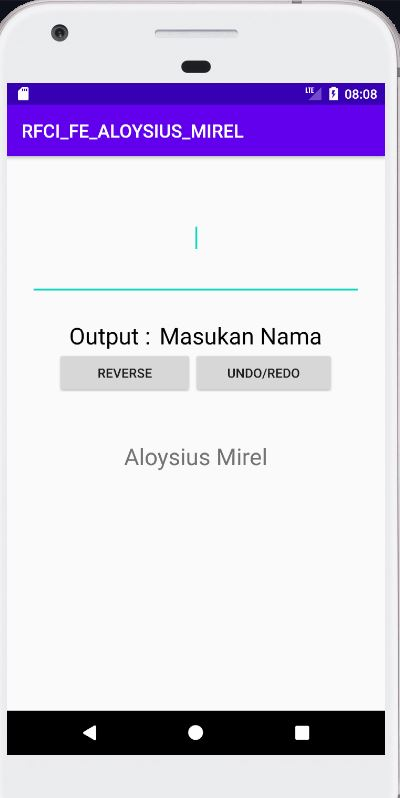
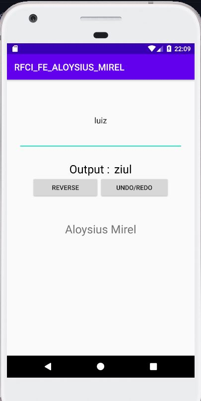
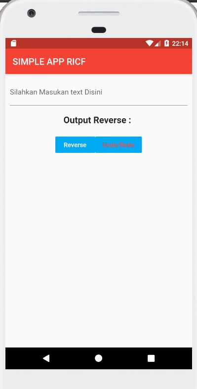
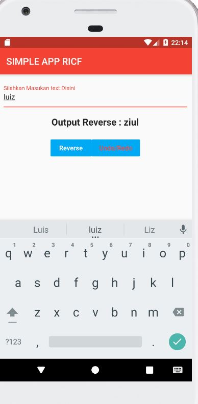

## Sorting
Buatlah sebuah program untuk menampilkan dan menghitung jumlah swap yang diperlukan agar sebuah deret angka menjadi berurutan.
Contoh input
4 9 7 5 8 9 3
Contoh output. Jika program dijalankan, output harus sama persis seperti dibawah ini
1. [7,9] -> 4 7 9 5 8 9 3
2. [5,9] -> 4 7 5 9 8 9 3
3. [5,7] -> 4 5 7 9 8 9 3
4. [8,9] -> 4 5 7 8 9 9 3
5. [3,9] -> 4 5 7 8 9 3 9
6. [3,9] -> 4 5 7 8 3 9 9
7. [3,8] -> 4 5 7 3 8 9 9
8. [3,7] -> 4 5 3 7 8 9 9 
9. [3,5] -> 4 3 5 7 8 9 9
10. [3,4] -> 3 4 5 7 8 9 9 

Jumlah swap: 10

jawaban
import java.util.Arrays;

public class SortingChiva {
    public static void insertionSort(int array[]) {
        int n = array.length;
        int count = 0;
        for (int j = 1; j < n; j++) {
            int current = array[j];
            int i = j-1;
            while ( (i > -1) && ( array [i] > current ) ) {
                array [i+1] = array [i];
                System.out.println((count+1) + ". [" + current + "," + array [i] +"]" + " -> " + Arrays.toString(array));
                i--;
                count++;
            }
            array[i+1] = current;
        }
        System.out.println("Jumlah swap = " + count);
    }

    public static void main(String a[]){
        int[] arr1 = {2,5,4,1,8,9,5};

        insertionSort(arr1);
        System.out.println("Hasil = " + Arrays.toString(arr1));

    }
}

## Tampilan SIMPEL APP JAVA

## Tampilan Aplikasi

  
  

## Tampilan SIMPEL APP FLUTTER

## Tampilan Aplikasi

  
  

